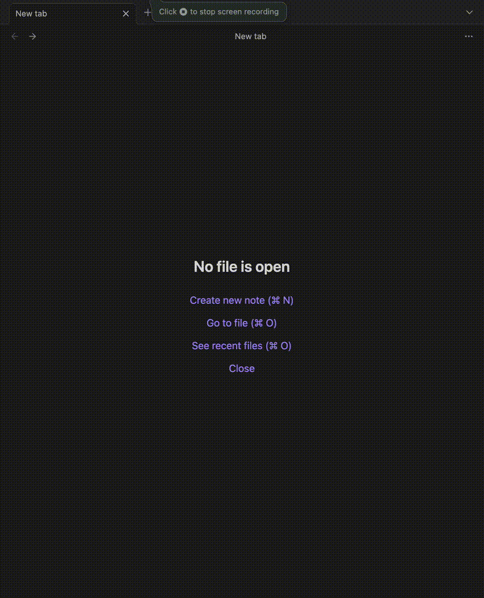
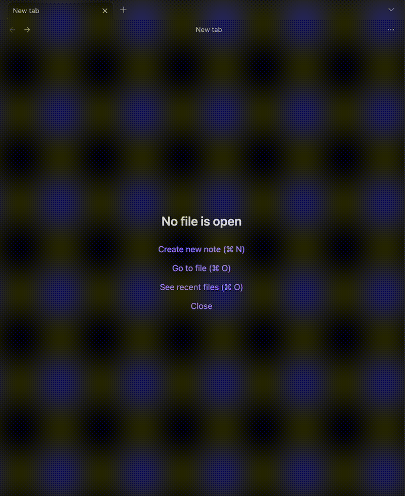

# Obsidian File Renamer Plugin
This plugin is aimed at automating the renaming of files and applying templates by recognizing file name patterns. I works by customizing regular expressions that are matched against file names, renaming the file using a separate pattern, and optionally applying an indicated template

## Motivation
I want to quickly create files, and by using name conventions, have them be renamed properly and have a template applied to them. I originally attempted to automate this using various plugins like [QuickAdd](https://github.com/chhoumann/quickadd) and [Templater](https://github.com/SilentVoid13/Templater), but was unable to get it to work in a fully transparent manner (i.e. just creating files) so I decided to write my own plugin.

# Configuration
Multiple file renaming rules can be configured in the plugin settings, with each rule containing the following fields:

| Setting           | Description                                                                                                                                                                | Example                     |
| ----------------- | -------------------------------------------------------------------------------------------------------------------------------------------------------------------------- | --------------------------- |
| File name (Regex) | This is the file name pattern to look for. It **is not** checked against the full path, just the file name.                                                                | `M-(.*).md`                 |
| New Name (Regex)  | The new name regex pattern. It can reuse the same positional and named groupings as the file name pattern, in which case they will be replaced when renaming the file.     | `Meeting - $1.md`           |
| Template to Apply | (Optional) Indicates if there is a template to apply to the file after renaming. Currently only supports [Templater](https://github.com/SilentVoid13/Templater) templates. | `Templates/Meeting Note.md` |

> Rules are applied in order. i.e. first rule that matches is applied.

# Examples

## Meeting notes

Quickly create a meeting note. 

### Rule

| Setting           | Value                     |
| ----------------- | --------------------------- |
| File name (Regex) | `M-(.*).md`                 |
| New Name (Regex)  | `Meeting - $1.md`           |
| Template to Apply | `Templates/Meeting Note.md` |

### Plugin behavior

## Quick notes

Quickly create a note about a topic, adding a template to specify that when the note was created. 
This example uses a named capture group.

### Rule

| Setting           | Value                     |
| ----------------- | --------------------------- |
| File name (Regex) | `Q-(?<name>.*).md`          |
| New Name (Regex)  | `[Quick Note] $name.md`     |
| Template to Apply | `Templates/Quick Note.md`   |

### Plugin behavior

# Future work
- Currently, if a file already has content in it no template is applied.
- The rules don't get applied when creating a new file from a link.
- Include path changes, not just file renames.

# Credits
This plugin takes inspiration from the Suggester code from the [Templater](https://github.com/SilentVoid13/Templater) plugin.